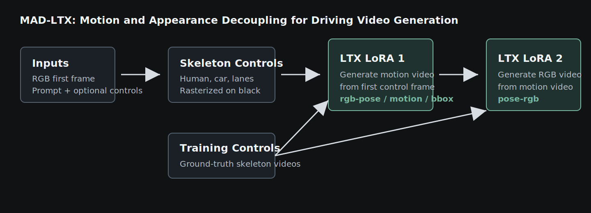

# MAD-LTX

<p align="center">
  <a href="https://vita-epfl.github.io/MAD-World-Model/"><b>Project Page</b></a> |
  <a href="https://arxiv.org/abs/2601.09452"><b>Paper</b></a> |
  <a href="https://huggingface.co/AhmadRH/MAD-LTX"><b>Checkpoints</b></a> |
  <a href="https://huggingface.co/datasets/AhmadRH/OpenDV_Poses"><b>OpenDV Poses</b></a> |
  <a href="https://hub.docker.com/r/ahparyald/mad-ltx"><b>Docker</b></a> |
  <a href="docs/inference.md"><b>Inference</b></a> |
  <a href="docs/training.md"><b>Training</b></a>
</p>

Controllable driving-video generation with motion and appearance decoupling.

MAD-LTX generates driving videos from a first frame, a text prompt, and optional structured controls such as ego motion, object motion, semantic segmentation, or HD maps. The method first predicts an intermediate motion representation, then conditions a second LTX-Video model on that motion video to generate the final RGB video.

<p align="center">
  
</p>

## What This Repo Contains

- Config-driven inference for the released MAD-LTX LoRA checkpoints.
- Training configs and latent-caching scripts for reproducing the main OpenDV LoRA models.
- Minimal retained utilities for ego-motion control rendering and panoptic-control coloring.
- Evaluation entrypoints for video quality and control-following metrics.

## Installation

The tested environment is captured in [Dockerfile](Dockerfile). You can build it locally:

```bash
docker build -t mad-ltx -f Dockerfile .
```

or start from the published image:

```bash
docker pull ahparyald/mad-ltx
```

If you prefer a native conda or pip setup, use the package list in the Dockerfile as the reference environment for both training and inference.

## Quick Inference

```bash
PYTHONPATH=src python -m ltxv_trainer.inference \
  --config configs/inference/rgb_pose_motion_13b.yaml \
  --prompt "The image depicts a residential urban road. A number of parked vehicles are present in the road, one parked directly in front of the ego vehicle. The surrounding environment includes buildings and trees. The lighting suggests daytime." \
  --rgb-image examples/inference/ego_motion/rgb_2.jpg \
  --control-image examples/inference/ego_motion/pose_2.jpg \
  --reference-video examples/inference/ego_motion/egomotion_2.mp4 \
  --out outputs/rgb_pose_motion
```

The command downloads the base model and selected LoRA checkpoint if they are not already cached. See [docs/inference.md](docs/inference.md) for all supported modes and example assets.

## Reproduce Training

Training has three stages:

1. Render intermediate motion representations from the released OpenDV pose files.
2. Cache LTX VAE latents and text embeddings.
3. Train the corresponding LoRA from `configs/training/rgb_to_pose.yaml` or `configs/training/pose_to_rgb.yaml`.

The commands and data-preparation notes are in [docs/training.md](docs/training.md).

## Evaluation

The evaluation entrypoints are in [evaluation](evaluation). They cover video quality metrics and trajectory-based control-following metrics, with commands documented in [evaluation/README.md](evaluation/README.md).

## Citation

```bibtex
@article{rahimi2026mad,
  title={MAD: Motion Appearance Decoupling for efficient Driving World Models},
  author={Rahimi, Ahmad and Gerard, Valentin and Zablocki, Eloi and Cord, Matthieu and Alahi, Alexandre},
  journal={arXiv preprint arXiv:2601.09452},
  year={2026}
}
```

## Acknowledgements

MAD-LTX builds on Lightricks' LTX-Video codebase and the broader ecosystem around Diffusers, Transformers, PEFT, OpenPifPaf, and DWPose.
